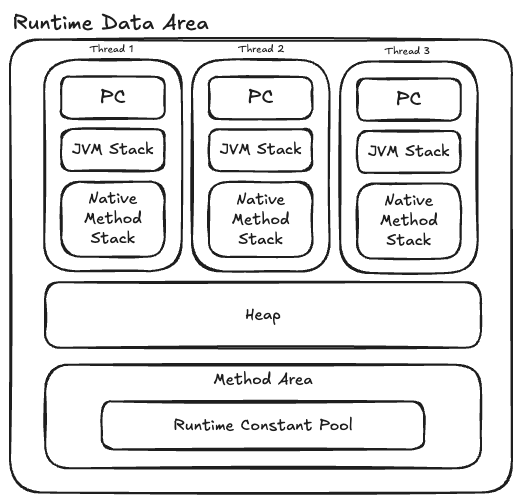

- JVM 이 관리하는 다양한 메모리 영역 소개
- 각 영역이 수행하는 역할과 관리 대상, 발생 할 수 있는 문제
---
# 런타임 데이터 영역

## 프로그램 카운터
- 작은 메모리 영역으로, 현재 실행중인 스레드의 바이트코드 줄 표시기
- 프로그램의 제어흐름, 순환, 점프, 예외 복원 등 표현
- 각 스레드의 카운터는 서로 독립적인 영역에 저장
- 네이티브 메서드를 실행할 땐 프로그램 카운터에 기록하지 않음
    - 왜?? -> os에서 직접 실행함, jvm 바이트 코드 주소가 없음
## JVM 스택
- 스레드 프라이빗 (연결된 스레드와 생성/삭제 시기가 일치)
- 스택 프레임을통해 지역변수 테이블, 연산자 스택, 동적 링크, 메서드 반환값 등 정보를 저장
### 지역 변수 테이블
- 데이터 타입, 객체 참조, 반환 주소 타입을 저장
- 한슬롯 32비트, Double같은 64비트 2개 슬롯 사용
- 컴파일 과정에서 할당되며 런타임에 변경되지 않음
- 스레가 요청한 스택 깊이가 JVM 허용 범위보다 높다면 StackOverFlow
- JVM이 스택을 확장하려는 시점에 메모리가 부족하면 OutOfMemory
## 네이티브 메서드 스택
- 네이티브 메서드를 실행할 때 사용하는 스택
- JNI로 부터 호출된 네이티브 코드의 실행을 관리
## 힙
- 자바 애플리케이션이 사용할 수 있는 가장 큰 메모리
- 모든 스레드가 공유하며 JVM이 구동될 때 만들어짐
- 인스턴스를 저장하기 위한 목적
- 거의 모든 인스턴스가 이 영역에 할당됨
- GC가 관리하는 메모리 영역
    - generational collectfion theory 으로 구성됨 -> GC에서..
- 각 스레드별 스레드 로컬 할당 버퍼로나뉨 -> 메모리 회수와 할당을 빠르게..
- 힙은 물리적으로 떨어진 메모리 위치해도 상관없음, 논리적으로는 연속되어야함.
- 과거에는 들어맞던 이론들이.. JVM 의 발전으로 점점 경계가 사라지고있는 추세..
## 메서드 영역(클래스, 스태틱 영역)
- 모든 스레드가 공유
- 타입 정보, 상수, 정적 변수, JIT 컴파일러 컴파일 코드 캐시 저장

https://velog.io/@aryumka/JVM%EC%9D%98-%EB%A9%94%EC%84%9C%EB%93%9C-%EC%98%81%EC%97%AD-feat.-PermGen-space
- PermGen 영역
    - 고정된 사이즈를 가졌음 개발자가 영역 확보를 신경써야함, OOM가능성
    - Heap 영역, JVM관리대상
    - 클래스, 메서드 등 메타정보 저장
    - 힙 영역이라 GC대상이었으나.. 이정보들은 회수할 일이 없음
- MetaSpace 영역
    - 8이후로 등장 Native 영역
    - 클래스, 메서드 메타 정보 저장
    - static 상수 변수들은 Heap영역에 저장됨
    - OS에서 동적으로 메모리 조정
## 런타임 상수 풀
- 메서드 영역의 일부
- 클래스 버전, 필드, 메서드, 인터페이스 등 리터럴, 심벌 참조 저장
- 런타임 상수풀은 동적임
- 런타임에도 메서드 영역의 런타임 상수풀에 새로운 상수 추가 가능
## 다이렉트 메모리
- 힙이 아닌 메모리 직접 할당 가능
- 이것도 메모리기 떄문에 결국 하부 기기 총메모리를 넘어 설 수 없음
---
# 핫스팟 가상 머신에서의 객체
## 객체 생성
- 바이트코드 new 와 init 을 통해 생성
- 메모리 공간 할당은 힙에서 메모리 블록을 잘라주는 것
- GC에 따라 여유 목록 할당방식을 결정함
    - 여유목록 -> 객체 인스턴스를 담기에 충분한 공간을 찾아 할당후 목록을 갱신
- 여러 스레드가 동시에 객체를 생성하려고 한다면
    - 메모리 할당을 동기화
    - 스레드마다 다른 메모리 공간을 받아 할당(스레드 로컬 할당 버퍼)
- 메모리 할당이 끝나면 0으로 초기화(기본생성자로 객체를 생성해도 사용가능한 이유)
## 객체 메모리 레이아웃
### 객체 헤더
- 마크워드
    - 객체 자체의 런타임데이터
    - 해시코드, GC세대 age, 락 상태 플래그, 스레드 점 락, 편향된 스레드 아이디, 편향된 시간 타임스탬프
    - 구조는 동적으로 의미가 달라짐
- 클래스워드
    - 클래스 메타데이터, 메타스페이스 참조
- 배열길이
    - 배열의 크기
    - 데이터 타입은 원소의 데이터 타입
### 인스턴스 데이터
- 객체가 실제로 담고있는 정보
- 필드, 부모클래스, 부모클래스의 필드 정보들..
### 정렬 패딩
- 객체 시작 주소는 8바이트 정수배여야 함. 모든 객체의 크기가 8바이트 정수배라는 의미
- 자리 차지를 위해 공간만 확보함
## 객체 접근
- 핸들 방식
    - 안정적인 핸들의 주소가 저장됨
    - 참조가 변경되더라도 해당 포인터만 변경해주면 됨
- 다이렉트 포인터 방식
    - 빠르다.
    - 핸들을 경유하는 오버헤드가 없음
    - 핫스팟은 주로 다이렉트 포인터 방식을 이용함

# 실전 OutOfMemoryError
## 힙 오버플로우
- 자바에서 OOM 가장 많이 발생하는 영역
- 힙덤프 스냅숏 분석
- 반드시 필요한객체인가
    - 그렇다 -> 오버플로 -> 메모리 할당
    - 그렇지 않다 -> 메모리 누수
- 코드 생명주기 관리 필요
## 가상 머신 스택과 네이티브 메서드 스택 오버플로우
- 핫스팟 가상머신은 네이티브, jvm스택을 구분하지 않음
- 핫스팟 가상머신은 스택 확장을 지원하지 않음
- 운영체제가 할당하는 메모리 크기가 제한적임
    - 32비트 윈도우 최대 메모리 2GB
    - 2GB 에서 힙,메서드 영역을 제외한 나머지에 스레드를 할당함
    - 즉 스레드에 스택 메모리를 많이 할당하면 생성가능한 스레드 수가 줄어든다.
- 너무 많은 스레드를 만들어서 OOM이 발생한다면
    - 최대힙과 스택용량을 줄여야함
## 메서드 영역과 런타임 상수 풀 오버플로우
- jdk7
    - PermGen 영역의 OOM
    - 상수풀이 메서드 영역의 일부로 잡히기때문에 계속 할당하면 OOM터짐
- jdk7 이후
    - 상수풀이 힙영역으로 옮겨짐
    - GC 대상이 되기때문에 이상 없음
- CGLib 같이 바이트코드 조작 기술을 써 클래스를 동적으로 로딩함 -> 더 큰 메서드 영역이 필요해짐
- 동적 클래스를 많이 생성하면 클래스 회수 시점도 신경써야함
## 네이티브 다이렉트 메모리 오버플로우
- 메모리 오버플로우로 생성된 덤프 파일이 매우 작다면, DirectMemory 직간접 사용했다면 네이티브 다이렉트 메모리 의심

---
# 핫스팟 JVM

실행 중 **자주 사용되는(핫스팟)** 코드를 찾아 **최적화(Just-In-Time Compilation, JIT)** 하는 기술입니다.  
즉, 자주 실행되는 코드(핫스팟)를 네이티브 코드로 변환하여 **성능을 크게 향상**시킵니다.

**JVM은 바이트코드를 직접 실행하지 않고, 해석(Interpretation)하거나 컴파일(Compilation)하여 실행합니다.**  
HotSpot JVM은 **핫스팟(자주 실행되는 코드)를 찾아 네이티브 코드로 변환**하는 방식을 사용합니다.

✅ **핫스팟 최적화 과정**  
1️⃣ **바이트코드 인터프리터(Interpreter)**
- 처음 실행할 때는 **바이트코드를 한 줄씩 해석하여 실행**
- 속도가 느리지만, 빠르게 실행 가능

2️⃣ **핫스팟 코드 감지**
- 특정 메서드나 루프가 **자주 실행되면(핫스팟 감지)**
- 해당 코드를 네이티브 코드로 변환

3️⃣ **JIT(Just-In-Time) 컴파일러 실행**
- 감지된 핫스팟 코드를 **기계어(네이티브 코드)로 컴파일**
- 이후부터는 해석 없이 빠르게 실행 가능 🚀

4️⃣ **런타임 최적화 (Profile-Guided Optimization, PGO)**
- 실행 중 불필요한 코드 제거 (Dead Code Elimination)
- 인라이닝(Inlining), 루프 최적화(Loop Unrolling) 수행
- 최적화 결과를 기반으로 추가 변환 수행

💡 **핫스팟 JVM은 실행 중 코드를 지속적으로 분석하고 최적화하여 성능을 극대화합니다!**

---
# 🚀 **JIT(Just-In-Time) 컴파일러**

HotSpot JVM의 가장 강력한 기능 중 하나는 **JIT(Just-In-Time) 컴파일러**입니다.  
JIT 컴파일러는 바이트코드를 **네이티브 코드(기계어)로 변환하여 실행 속도를 높이는 역할**을 합니다.

### 📌 **JIT 컴파일러의 종류**

| JIT 컴파일러                | 설명                              |
| ----------------------- | ------------------------------- |
| **C1(Client Compiler)** | 빠르게 실행되지만 최적화는 적음 (초기 실행에 유리)   |
| **C2(Server Compiler)** | 실행 속도를 높이기 위해 강력한 최적화 수행        |
| **Graal JIT Compiler**  | 최신 JIT, 성능과 확장성이 뛰어나며 Java로 구현됨 |
